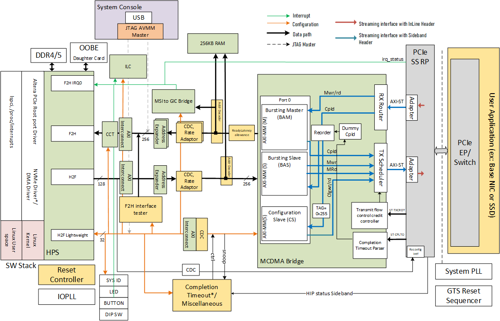

# Intel® Agilex™ 7 PCIe Root Port System Example Design

This system example design demonstrates a PCIe root port running on the [Intel® Agilex™ 7 M-Series Development Kit](https://www.intel.com/content/www/us/en/products/details/fpga/development-kits/agilex/agm039.html) connected to a Non-Volatile Memory express (NVMe) endpoint. The PCIe root port is capable of Gen5x4 speeds. The design is intended to serve as a reference to customers on how to implement and run a performant root port system using the Intel® Agilex™ 7 SoC and relevant IP.

For more information, refer to the [PCIe Root Port User Guide](https://altera-fpga.github.io/rel-24.3/embedded-designs/agilex-7/m-series/pcie_rp/ug-pcie_rp-agx7m-hbm2e/).

## Description

The PCIe root port example design is based on the Intel® Agilex™ 7 Golden System Reference Design (GSRD) with the following components added:

- Linux driver for PCIe root port IP that runs on HPS, enumerates the PCIe endpoint(s) and configures the PCIe root port Hard IP (HIP) through a dedicated reconfiguration AVMM interface.
- The Multichannel DMA (MCDMA) bridge which interfaces between the SoC's AXI-MM interface on one end and the AXI-ST interface on the PCIe root port IP (carrying PCIe TLP traffic) on the other.
- Various bridges, interconnects and adapters to handle clock crossing, data path and control path.

The system block diagram is shown below:



- The HPS-to-FPGA (H2F) lightweight AXI-4 interface on the HPS is used for accessing the control and status (CSR) interface of various blocks on the design. It connects to the reconfiguration interface on the PCIe root port HIP as well as the Configuration Slave (CS) interface on the MCDMA bridge.
   - Configuration of the PCIe Endpoint (as part of Enumeration) is done via the CS interface. This interface supports only one outstanding config write/read transaction, as the number of PCIe tags allotted to this interface is only one (inside the MCDMA bridge).
   - The connection to the HIP reconfiguration interface allows for updating the Type1 configuration space fields such as Primary, Secondary and Subordinate Bus numbers as well as Memory ranges to support different addressing schemes, i.e., Route by ID or Route by Address. PCIe root port configuration and status register accesses for IRQ and error status are also done via the same path.
- Transfer of large memory transactions between the SoC's H2F AXI4 interface and the PCIe endpoint occurs via the Bursting AVMM Slave (BAS) AVMM interface on the MCDMA bridge. This interface theoretically supports 64 outstanding read transactions. PCIe completion re-ordering is handled inside the MCDMA bridge on the PCIe side, as the AVMM protocol does not support any ordering rules. AVMM address width is always set to 32/64 bit.
- MSI/MSI-X interrupts from the PCIe endpoint are handled through the Bursting AVMM Master (BAM) interface on the bridge IP.
- The bridge IP also supports memory requests (Read/Write) initiated by the endpoint (DMA bus mastering) targeting System Memory. These transactions are routed via the HPS's FPGA-to-HPS (F2H) AXI4 interface as shown in the diagram. In PCIe root port mode, this interface supports 32/64-bit addressing only.

## Repository Structure

Directory Structure used in this example design:

 ```bash
    |--- doc
    |--- src
    |   |--- hw
    |   |--- sw
 ```

## Project Details

- **Family**: Intel® Agilex™ 7
- **Quartus Version**: 24.3
- **Development Kit**: [Intel® Agilex™ 7 FPGA M-Series Development Kit - HBM2e Edition (3x F-Tile & 1x R-Tile)](https://www.intel.com/content/www/us/en/products/details/fpga/development-kits/agilex/agm039.html)
- **Device Part**: AGMF039R47A1E2VR0

## Getting Started

Follow the steps below to build the design:

- [Building the hardware](src/hw/README.md)
- [Building the software](src/sw/README.md)
